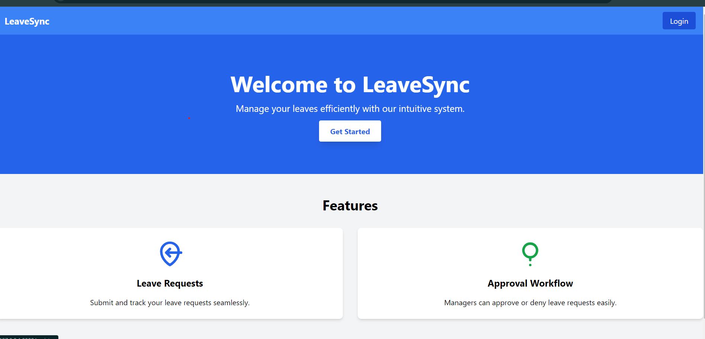
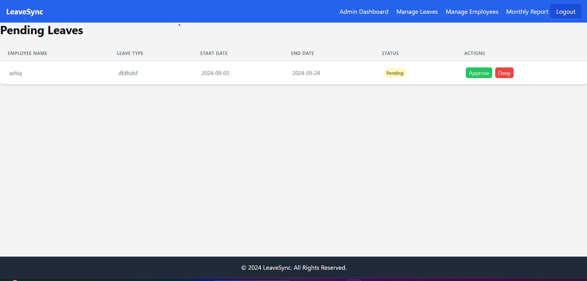
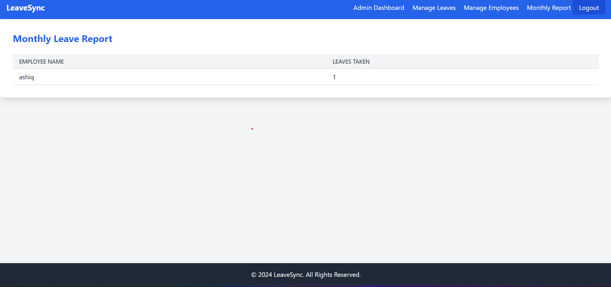

# LeaveSync

A comprehensive Leave Management System built with Laravel 10.0 and Tailwind CSS. This application allows employees to apply for leave, while administrators can approve or deny these requests. The system also sends email notifications to users when their leave requests are approved or denied.

## Table of Contents

-   [Features](#features)
-   [Installation](#installation)
-   [Screenshots](#screenshots)

## Features

-   User authentication (login, registration)
-   User dashboard to view and manage leave requests
-   Admin dashboard to view pending, approved, and denied leave requests
-   Create, edit, and delete leave requests
-   Email notifications for leave approval and denial
-   Responsive UI with Tailwind CSS

## Installation

### Prerequisites

-   [PHP](https://www.php.net/downloads) >= 8.0
-   [Composer](https://getcomposer.org/download/)
-   [Node.js](https://nodejs.org/en/download/) & npm
-   [MySQL](https://dev.mysql.com/downloads/)

## UI Screenshots

